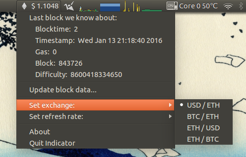

## Ether-Price-Indicator

[Based on Crypto-Price-Indicator by jjb]

A Python-based Ubuntu indicator showing the current value of Ethereum's Ether currency, together with
information about the latest block mined on Ethereum's blockchain.

Values are sourced from www.etherchain.org using their public API. 

The currency conversions available are:
 * Ether, in USD
 * Ether, in BTC
 * Bitcoins, in ETH
 * US dollars, in ETH

### Setup
Run `python setup.py` and follow the instructions that are presented.

Requires Python and the `pip` installer to be installed. 

### Screenshots
#### Bar

#### Menu
 

#### Donations are welcome!

 * BTC: 1HCAo4UeQjQrtxCBUzatYxzt8u1UyafPi5
 * ETH: 0x581ebac13606b1583226984f234252e561e0fa14
